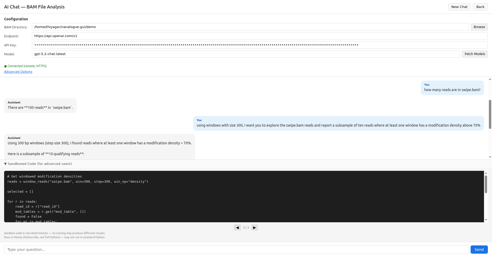

# `nanalogue-gui`

Electron GUI for Nanalogue: interactive nanopore data analysis and curation.

[](https://opensource.org/licenses/MIT)
[](https://codecov.io/gh/sathish-t/nanalogue-gui)

Nanalogue-gui provides a desktop application for working with BAM/CRAM/Mod-BAM
files, with a focus on single-molecule DNA/RNA modifications. It builds on
[@nanalogue/node](https://github.com/sathish-t/nanalogue-node) to provide
interactive visualisation and curation workflows.


## Table of Contents

- [Requirements](#requirements)
- [Installation](#installation)
- [Usage](#usage)
- [Modes](#modes)
  - [QC](#qc)
  - [Swipe](#swipe)
  - [Locate Reads](#locate-reads)
  - [AI Chat](#ai-chat)
    - [CLI (nanalogue-chat)](#cli-nanalogue-chat)
- [Development](#development)
- [Versioning](#versioning)
- [Changelog](#changelog)
- [License](#license)
- [Acknowledgments](#acknowledgments)

## Requirements

- Node.js 22 or higher

## Installation

You can download the release binaries from Github.
Please look at the binaries attached to each release, and download the binary of your platform
(macOS/Linux). For Windows, we recommend running our linux binary using the Windows subsystem for Linux (WSL).
Please see this [link](https://learn.microsoft.com/en-us/windows/wsl/install) or equivalent to learn about WSL.

NOTE: In Macs, if you download the binary, you may have to ignore a warning from Gatekeeper
saying the developer is unknown.
To avoid this warning, the authors here have to apply for an Apple developer license etc.
so we have chosen to not do this. Please note that this project is open source,
so you are free to inspect the source code here.
You can always build from source to avoid such warnings.

To build from source, please use the command below.
You would first need to install utilities like `npm` and `git`.

```bash
git clone https://github.com/sathish-t/nanalogue-gui.git
cd nanalogue-gui
npm install
```

## Usage

If you have installed the app from a binary, just launch the binary like you normally would.
If you built it yourself, you can launch it from the command line like this:

```bash
npm start
```

This launches the landing page where you can choose between QC, Swipe,
Locate Reads, and AI Chat modes.

## Modes

### QC

Quality control analysis of BAM/CRAM/Mod-BAM files. Generates interactive
charts covering read lengths, yield, analogue density, modification
probabilities, and per-read sequences.

We demonstrate QC with a small BAM file containing simulated
sequencing data.

The configuration screen allows setting:
- BAM/CRAM source (local file or URL)
- Modification filter (e.g., `+T`, `-m`, `+a`)
- Genomic region (e.g., `chrI:1000-50000`)
- Mod region to restrict modification filtering to a sub-region
- Read length histogram resolution (1 / 10 / 100 / 1,000 / 10,000 bp)
- Sample fraction (0.01%--100%) with deterministic seed
- Window size (2--10,000 bases of interest)
- Advanced options: MAPQ filters, read type filters, length filters,
  read ID file, base quality and probability thresholds

**QC configuration screen:**


**QC configuration with a loaded BAM file:**


QC result tabs:
- **Read Lengths**: histogram of aligned read lengths with summary statistics
- **Yield Curve**: cumulative yield by read count with total yield and N50
- **Analogue Density**: whole-read and windowed density histograms with
  optional range filters
- **Raw Probability**: modification probability distribution with optional
  range filter
- **Sequences**: per-read modification highlighting with quality tooltips,
  row selection, and read ID copy. Insertions and deletions are shown through
  lowercase bases and '.' respectively.

**Read length distribution:**


**Yield:**


**Analogue density histogram:**


**Modification probability distribution:**

Please note that this is from a simulated BAM file with artificial data.


**Per-read modification sequences:**


### Swipe

Interactive annotation curation. Displays modification signal plots for each
annotation in a BED file, allowing the user to accept or reject each one.

The configuration screen allows setting:
- BAM/CRAM source (local file or URL)
- BED annotations file path (You need a BED file with at least four tab-separated columns: contig, start, end, read name)
- Output file path
- Modification filter (e.g., `+T`, `-m`)
- Window size (for windowed density)
- Flanking region size (base pairs)
- Annotation highlight visibility


Controls:
- **Right arrow** or **Accept button**: accept the annotation
- **Left arrow** or **Reject button**: reject the annotation

**Reviewing an annotation:**


**Reviewing another annotation:**


### Locate Reads

Converts a list of read IDs into a BED file by looking up their genomic
coordinates in a BAM/CRAM file. Useful for finding where specific reads of
interest map in the genome.

The configuration screen allows setting:
- BAM/CRAM source (local file or URL)
- Read ID file (plain text, one read ID per line)
- Region (optional, e.g., `chr3` or `chrI:1000-50000`) to speed up processing
- Full region checkbox to restrict to reads that completely span the region
- Output BED file path

Output is tab-separated BED6 (contig, start, end, read_id, score, strand):
```
chr1	100	600	read_abc	1000	+
chr2	200	700	read_def	1000	-
```

After generation, a summary shows the number of BED entries written, read IDs
not found in the BAM, and unmapped reads excluded from the output.

### AI Chat

Experimental mode for asking natural-language questions about BAM files.
Connects to any OpenAI-compatible API endpoint (local or remote) and uses
tool calls to query BAM data in a sandboxed environment.

**AI Chat works with any provider that exposes an OpenAI-compatible v1 API
endpoint.** This includes cloud providers like OpenAI, Anthropic,
Google Gemini, Mistral, Together AI, Fireworks, and OpenRouter, as well as
local runners like Ollama and LM Studio.

#### Setting up a provider

To use AI Chat, you need three things: an **API endpoint URL**, an **API key**
(if the provider requires one), and a **model name**.
Any other provider that supports the OpenAI v1 chat completions protocol
(`POST /v1/chat/completions`) will also work.
Please note that unless you have a local LLM that you or your organization are running,
it is likely that you will be charged per request to these URLs.

We have tested for the following providers either manually or automatically in this repository.

| Provider | Endpoint URL | API key | How to get started |
|---|---|---|---|
| [OpenAI](https://platform.openai.com/) | `https://api.openai.com/v1` | required | Create an account and generate an API key at [platform.openai.com/api-keys](https://platform.openai.com/api-keys) |
| [Anthropic](https://www.anthropic.com/) | `https://api.anthropic.com/v1/` | required | Create an account and generate an API key at [console.anthropic.com](https://console.anthropic.com/) |
| [Google](https://ai.google.dev/) | `https://generativelanguage.googleapis.com/v1beta` | required | Create an account and generate an API key at [aistudio.google.com/apikey](https://aistudio.google.com/apikey) |

You can also start an LLM using a package like llama.cpp, and then use the URL.
In this scenario, you or your organization are running the LLM yourselves.
For example, this command starts a small Qwen LLM and exposes it at `http://url_of_the_computer:8000`.
You have to install llama.cpp, configure its parameters, choose a model etc.
The command shown below is for illustrative purposes only--the flags etc. may have
changed since the time of writing.
A bigger model on a computer with better hardware specs will generally give
better results.

```bash
./build/bin/llama-server \
      -hf Qwen/Qwen3-8B-GGUF:Q4_K_M \
      --jinja \
      -ngl 99 \
      -c 32768 \
      -n 8192 \
      --host 0.0.0.0 \
      --port 8000
```

These are other suggestions for LLM providers/setups that we haven't tested ourselves.

| Provider | Endpoint URL | API key | How to get started |
|---|---|---|---|
| [Ollama](https://ollama.com/) (local) | `http://localhost:11434/v1` | not required | Install Ollama, then `ollama pull <model>` |
| [LM Studio](https://lmstudio.ai/) (local) | `http://localhost:1234/v1` | not required | Download a model from the LM Studio UI |
| [OpenRouter](https://openrouter.ai/) | `https://openrouter.ai/api/v1` | required | Sign up and create a key at [openrouter.ai/keys](https://openrouter.ai/keys); gives access to many models |
| [Together AI](https://www.together.ai/) | `https://api.together.xyz/v1` | required | Sign up and create a key in the dashboard |
| [Fireworks](https://fireworks.ai/) | `https://api.fireworks.ai/inference/v1` | required | Sign up and create a key in the dashboard |

#### Choosing a model

Use the **Fetch Models** button after entering your endpoint URL and API key
to see which models are available from your provider. For best results, choose
a model that supports **tool calling** (also called function calling), since
AI Chat relies on tool calls to query your BAM data. Larger models generally
give better answers but respond more slowly; smaller models are faster but may
struggle with complex questions.

The configuration screen allows setting:
- BAM directory path
- API endpoint URL (defaults to `http://localhost:11434/v1` for Ollama)
- API key (if your provider requires one)
- Model name (with Fetch Models button for auto-discovery)
- Advanced options including sandboxed code execution

NOTE: Depending on the provider and model you choose, your context lengths etc. could be different.
If possible, please look up your model's parameters such as context length and change them using the
Advanced options link in the screenshots below. For example, the GPT-5.2 model uses a 400K context window
(see [here](https://developers.openai.com/api/docs/models/gpt-5.2)) whereas Deepseek v2 lite uses a 32K
context window (see [here](https://huggingface.co/deepseek-ai/DeepSeek-V2-Lite)). A higher context window
means the model can remember more of your chat, and can respond to longer prompts. Whether this is
relevant for you depends on how you use the chat feature here.

**AI Chat with a connected endpoint:**


**Asking a question about BAM data:**


**Multi-turn conversation:**


**Display sandboxed code:**

We use a python sandbox to receive code from the LLM and execute it.
Our sandbox uses the [Monty](https://github.com/pydantic/monty) package from pydantic to run python
code in a secure way so that it has access only to our files and to specific functions.
This ensures our sandbox is secure, and allows us to inspect what the LLM is doing.



#### CLI (nanalogue-chat)

The same AI Chat analysis engine is available as a standalone terminal REPL,
with no Electron or GUI needed. After building, run:

```bash
npm run build
node dist/cli.mjs --endpoint <url> --model <name> --dir <path>
```

For example, to chat about BAM files in `./data` using a local Ollama model:

```bash
node dist/cli.mjs --endpoint http://localhost:11434/v1 --model llama3 --dir ./data
```

**Authentication:** pass your API key with `--api-key <key>`, or set the
`$API_KEY` environment variable. Local runners like Ollama do not require a key.

**Model discovery:** use `--list-models` with an endpoint to see which models
are available:

```bash
node dist/cli.mjs --endpoint https://api.openai.com/v1 --api-key $API_KEY --list-models
```

**REPL commands:**

| Command | Action |
|---|---|
| `/new` | Start a new conversation |
| `/quit` | Exit the CLI |
| Ctrl+C during a request | Cancel the current request |
| Ctrl+C at the prompt | Exit |

For the full list of providers and endpoint URLs, see the
[Setting up a provider](#setting-up-a-provider) table above.

Advanced options (context window size, timeouts, record limits) are available
via flags — run `node dist/cli.mjs --help` for details.

## Development

```bash
# Build the project (produces dist/main.js, dist/renderer.js, and dist/cli.mjs)
npm run build

# Run in development mode
npm run dev

# Run tests
npm test

# Lint (Biome, ESLint, Stylelint, html-validate)
npm run lint

# Auto-fix linting issues
npm run lint:fix

# TypeScript type checking
npx tsc --noEmit
```

Development environment:
  - Node.js >= 22 is required to run the app
  - Development and CI use Node 22 as the minimum version; Node 24 is also tested
  - The package-lock.json is generated with Node 22's npm (v10) via a pre-commit hook, so npm ci works consistently across Node versions
  - https://github.com/nvm-sh/nvm is required for development — the pre-commit hook uses nvm exec 22 to keep the lock file compatible

Note that the development environment notes are only relevant if you intend to play with the code
or add features. They are not relevant if you want to just install and run the app. Just go to
the [installation](#installation) section of this document.

## Versioning

We use [Semantic Versioning](https://semver.org/).

**Current Status: Pre-1.0 (0.x.y)**

While in 0.x.y versions:
- The API may change without notice
- Breaking changes can occur in minor version updates

After 1.0.0, we will guarantee backwards compatibility in minor/patch releases.

## Changelog

See [CHANGELOG.md](CHANGELOG.md) for version history.

## License

MIT License - see [LICENSE](LICENSE) for details.

## Acknowledgments

This software was developed at the Earlham Institute in the UK.
This work was supported by the Biotechnology and Biological Sciences
Research Council (BBSRC), part of UK Research and Innovation,
through the Core Capability Grant BB/CCG2220/1 at the Earlham Institute
and the Earlham Institute Strategic Programme Grant Cellular Genomics
BBX011070/1 and its constituent work packages BBS/E/ER/230001B
(CellGen WP2 Consequences of somatic genome variation on traits).
The work was also supported by the following response-mode project grants:
BB/W006014/1 (Single molecule detection of DNA replication errors) and
BB/Y00549X/1 (Single molecule analysis of Human DNA replication).
This research was supported in part by NBI Research Computing
through use of the High-Performance Computing system and Isilon storage.
