# `nanalogue-gui`

Electron GUI for Nanalogue: interactive nanopore data analysis and curation.

[](https://opensource.org/licenses/MIT)
[](https://codecov.io/gh/sathish-t/nanalogue-gui)

Nanalogue-gui provides a desktop application for working with BAM/CRAM/Mod-BAM
files, with a focus on single-molecule DNA/RNA modifications. It builds on
[@nanalogue/node](https://github.com/sathish-t/nanalogue-node) to provide
interactive visualisation and curation workflows.

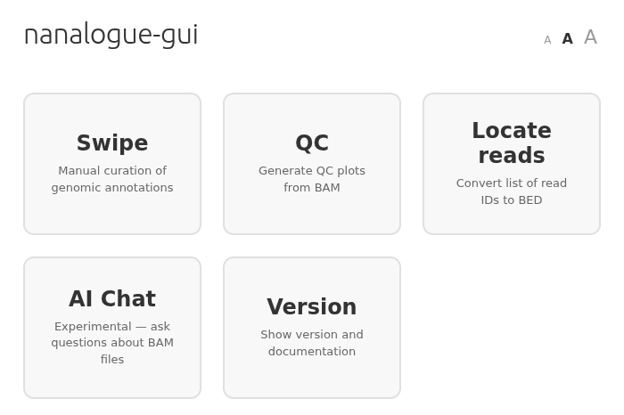

## Table of Contents

- [Requirements](#requirements)
- [Installation](#installation)
- [Usage](#usage)
- [Modes](#modes)
  - [QC](#qc)
  - [Swipe](#swipe)
  - [Locate Reads](#locate-reads)
  - [AI Chat](#ai-chat)
- [Development](#development)
- [Versioning](#versioning)
- [Changelog](#changelog)
- [License](#license)
- [Acknowledgments](#acknowledgments)

## Requirements

- Node.js 22 or higher

## Installation

You can download the release binaries from Github.
Please look at the binaries attached to each release, and download the binary of your platform
(macOS/Linux). For Windows, we recommend running our linux binary using the Windows subsystem for Linux (WSL).
Please see this [link](https://learn.microsoft.com/en-us/windows/wsl/install) or equivalent to learn about WSL.

NOTE: In Macs, if you download the binary, you may have to ignore a warning from Gatekeeper
saying the developer is unknown.
To avoid this warning, the authors here have to apply for an Apple developer license etc.
so we have chosen to not do this. Please note that this project is open source,
so you are free to inspect the source code here.
You can always build from source to avoid such warnings.

To build from source, please use the command below.
You would first need to install utilities like `npm` and `git`.

```bash
git clone https://github.com/sathish-t/nanalogue-gui.git
cd nanalogue-gui
npm install
```

## Usage

If you have installed the app from a binary, just launch the binary like you normally would.
If you built it yourself, you can launch it from the command line like this:

```bash
npm start
```

This launches the landing page where you can choose between QC, Swipe,
Locate Reads, and AI Chat modes.

## Modes

### QC

Quality control analysis of BAM/CRAM/Mod-BAM files. Generates interactive
charts covering read lengths, yield, analogue density, modification
probabilities, and per-read sequences.

We demonstrate QC with a small BAM file containing simulated
sequencing data.

The configuration screen allows setting:
- BAM/CRAM source (local file or URL)
- Modification filter (e.g., `+T`, `-m`, `+a`)
- Genomic region (e.g., `chrI:1000-50000`)
- Mod region to restrict modification filtering to a sub-region
- Read length histogram resolution (1 / 10 / 100 / 1,000 / 10,000 bp)
- Sample fraction (0.01%--100%) with deterministic seed
- Window size (2--10,000 bases of interest)
- Advanced options: MAPQ filters, read type filters, length filters,
  read ID file, base quality and probability thresholds

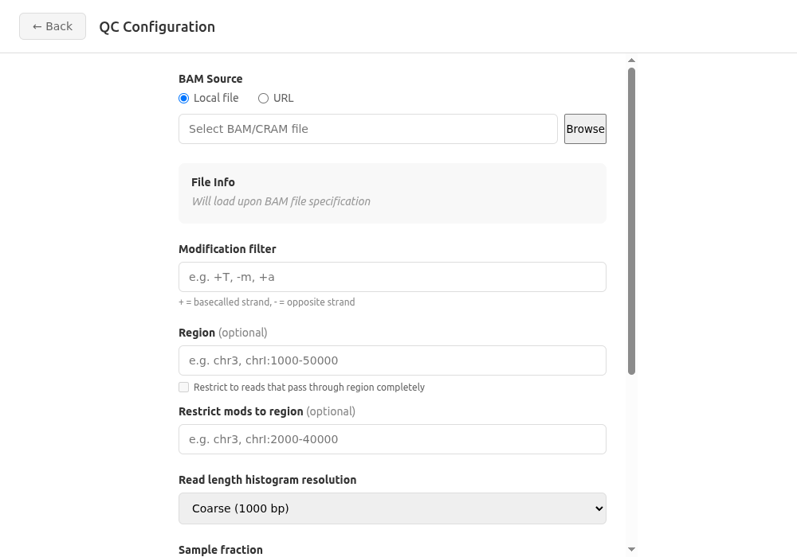
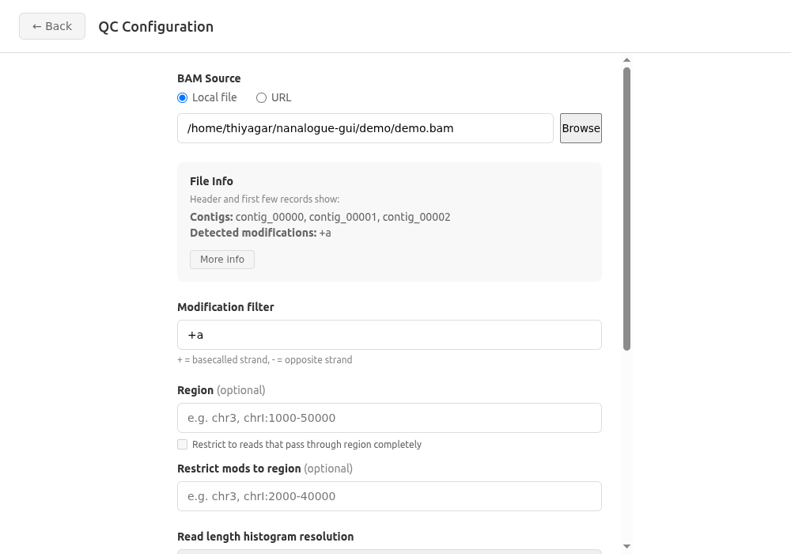

QC result tabs:
- **Read Lengths**: histogram of aligned read lengths with summary statistics
- **Yield Curve**: cumulative yield by read count with total yield and N50
- **Analogue Density**: whole-read and windowed density histograms with
  optional range filters
- **Raw Probability**: modification probability distribution with optional
  range filter
- **Sequences**: per-read modification highlighting with quality tooltips,
  row selection, and read ID copy. Insertions and deletions are shown through
  lowercase bases and '.' respectively.

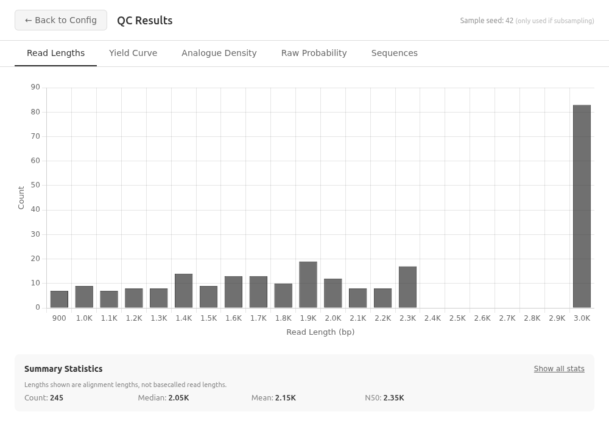
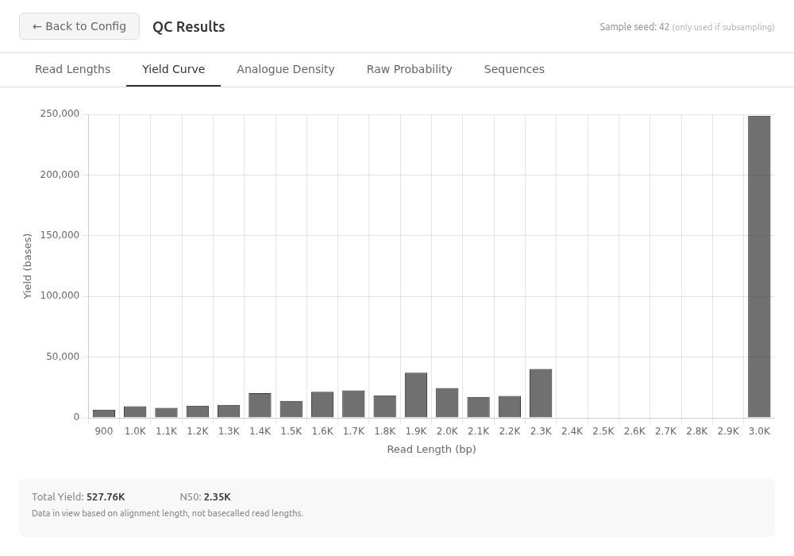
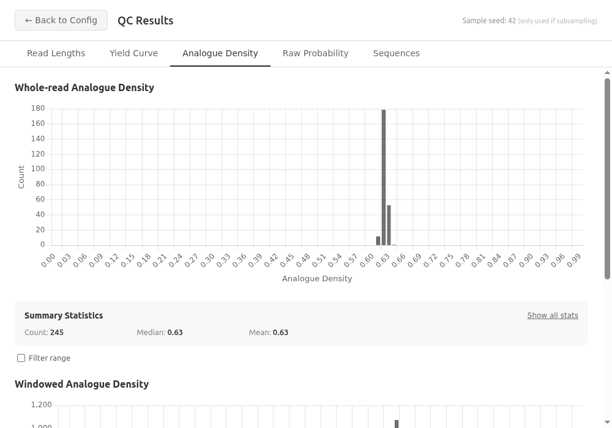

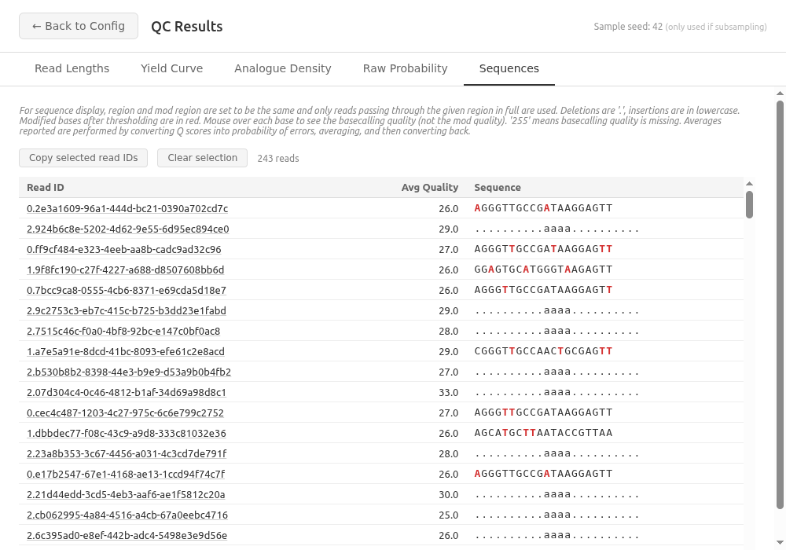

### Swipe

Interactive annotation curation. Displays modification signal plots for each
annotation in a BED file, allowing the user to accept or reject each one.

The configuration screen allows setting:
- BAM/CRAM source (local file or URL)
- BED annotations file path (You need a BED file with at least four tab-separated columns: contig, start, end, read name)
- Output file path
- Modification filter (e.g., `+T`, `-m`)
- Window size (for windowed density)
- Flanking region size (base pairs)
- Annotation highlight visibility

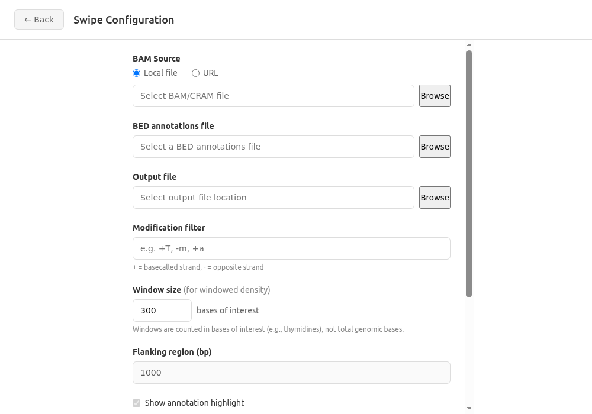

Controls:
- **Right arrow** or **Accept button**: accept the annotation
- **Left arrow** or **Reject button**: reject the annotation

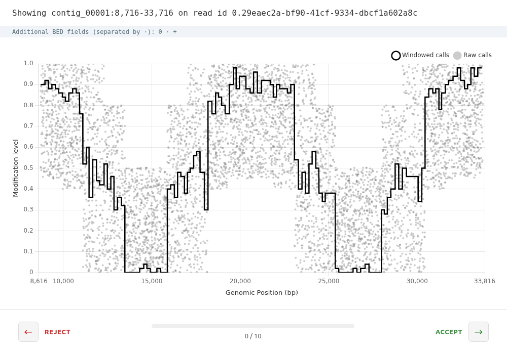
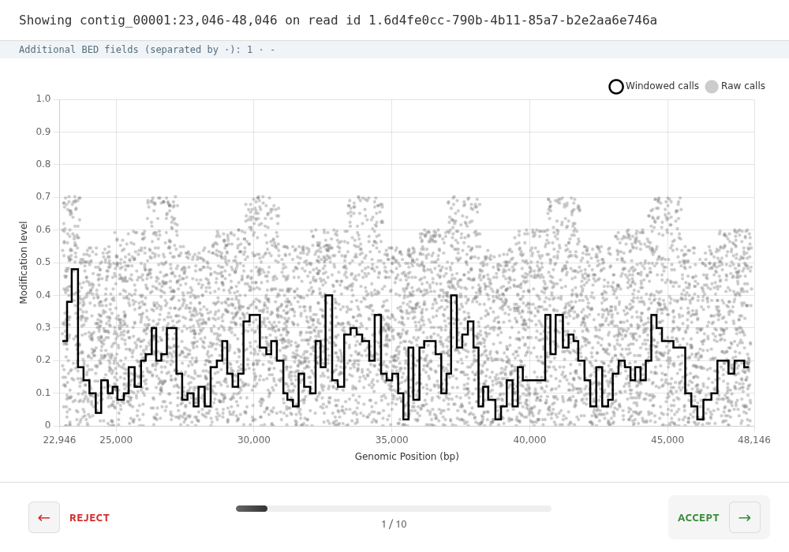

### Locate Reads

Converts a list of read IDs into a BED file by looking up their genomic
coordinates in a BAM/CRAM file. Useful for finding where specific reads of
interest map in the genome.

The configuration screen allows setting:
- BAM/CRAM source (local file or URL)
- Read ID file (plain text, one read ID per line)
- Region (optional, e.g., `chr3` or `chrI:1000-50000`) to speed up processing
- Full region checkbox to restrict to reads that completely span the region
- Output BED file path

Output is tab-separated BED6 (contig, start, end, read_id, score, strand):
```
chr1	100	600	read_abc	1000	+
chr2	200	700	read_def	1000	-
```

After generation, a summary shows the number of BED entries written, read IDs
not found in the BAM, and unmapped reads excluded from the output.

### AI Chat

Experimental mode for asking natural-language questions about BAM files.
Connects to any OpenAI-compatible API endpoint (local or remote) and uses
tool calls to query BAM data in a sandboxed environment.

The configuration screen allows setting:
- BAM directory path
- API endpoint URL (defaults to `http://localhost:11434/v1` for Ollama)
- API key (optional)
- Model name (with Fetch Models button for auto-discovery)
- Advanced options including sandboxed code execution


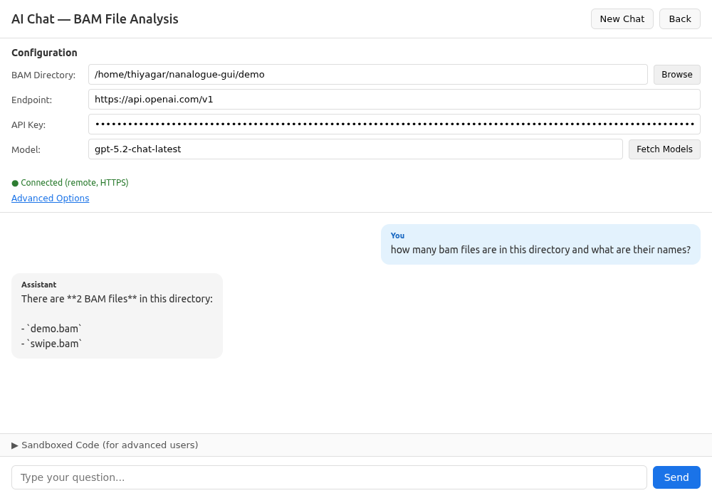
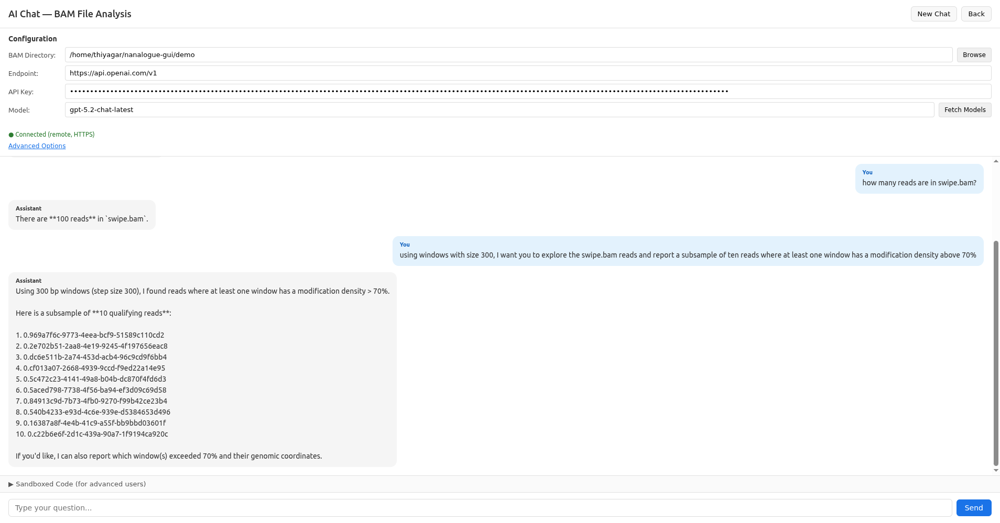

## Development

```bash
# Build the project
npm run build

# Run in development mode
npm run dev

# Run tests
npm test

# Lint (Biome, ESLint, Stylelint, html-validate)
npm run lint

# Auto-fix linting issues
npm run lint:fix

# TypeScript type checking
npx tsc --noEmit
```

## Versioning

We use [Semantic Versioning](https://semver.org/).

**Current Status: Pre-1.0 (0.x.y)**

While in 0.x.y versions:
- The API may change without notice
- Breaking changes can occur in minor version updates

After 1.0.0, we will guarantee backwards compatibility in minor/patch releases.

## Changelog

See [CHANGELOG.md](CHANGELOG.md) for version history.

## License

MIT License - see [LICENSE](LICENSE) for details.

## Acknowledgments

This software was developed at the Earlham Institute in the UK.
This work was supported by the Biotechnology and Biological Sciences
Research Council (BBSRC), part of UK Research and Innovation,
through the Core Capability Grant BB/CCG2220/1 at the Earlham Institute
and the Earlham Institute Strategic Programme Grant Cellular Genomics
BBX011070/1 and its constituent work packages BBS/E/ER/230001B
(CellGen WP2 Consequences of somatic genome variation on traits).
The work was also supported by the following response-mode project grants:
BB/W006014/1 (Single molecule detection of DNA replication errors) and
BB/Y00549X/1 (Single molecule analysis of Human DNA replication).
This research was supported in part by NBI Research Computing
through use of the High-Performance Computing system and Isilon storage.
