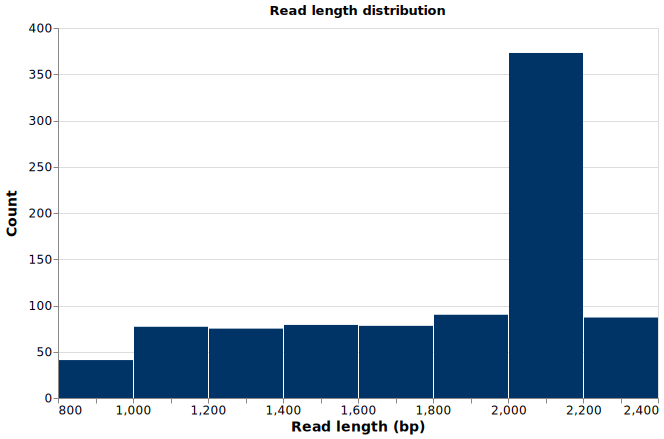
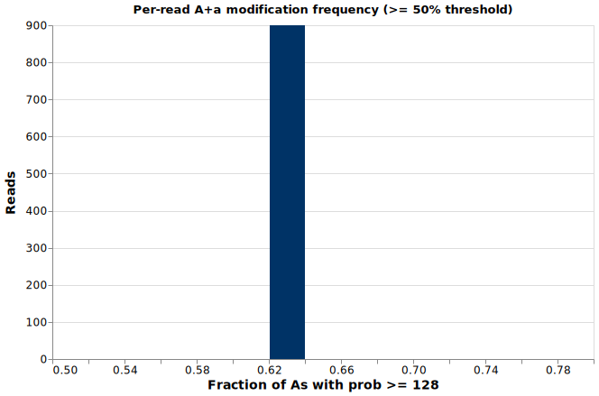
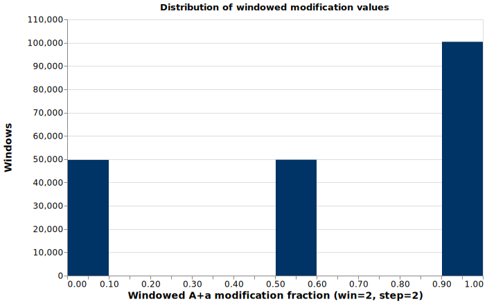

# plot_histogram: rendering SVG histograms from the sandbox

*2026-03-15T12:05:44Z by Showboat 0.6.1*
<!-- showboat-id: ca5a823c-eb63-481f-af44-9482434854ee -->

plot_histogram() is a sandbox external function that renders pre-binned histogram data as an SVG file using Vega-Lite server-side — no browser or DOM required. The caller computes the bins in Python; the tool handles rendering and writing. Output is written to `ai_chat_output/` unless you supply `output_path`. The SVG is write-only from the sandbox's perspective: the LLM cannot read it back, but the user can open it in any browser or image viewer.

## Read-length distribution

The simplest use: fetch all reads from a BAM file, bucket the sequence lengths into 200 bp bins, and plot. The only required argument is the `bins` list; each element is a dict with `bin_start`, `bin_end`, and `count`.

```bash
cat > /tmp/read_lengths.py << 'EOF'
# Fetch all reads and bucket lengths into 200 bp bins
rows = read_info('demo.bam', limit=200000)
lengths = [r['sequence_length'] for r in rows]

bin_size = 200
bins = {}
for l in lengths:
    b = (l // bin_size) * bin_size
    bins[b] = bins.get(b, 0) + 1

bin_dicts = [{'bin_start': b, 'bin_end': b + bin_size, 'count': bins[b]}
             for b in sorted(bins)]

for bd in bin_dicts:
    print(f"{bd['bin_start']}-{bd['bin_end']} bp: {bd['count']}")

result = plot_histogram(
    bin_dicts,
    output_path='ai_chat_output/read-lengths.svg',
    xlabel='Read length (bp)',
    ylabel='Count',
    title='Read length distribution',
)
print('Written to: ' + result['path'])
print('Bins plotted: ' + str(result['bins_plotted']))
EOF
rm -f ./demo/ai_chat_output/read-lengths.svg && node ./dist/execute-cli.mjs --dir ./demo /tmp/read_lengths.py
```

```output
800-1000 bp: 41
1000-1200 bp: 77
1200-1400 bp: 75
1400-1600 bp: 79
1600-1800 bp: 78
1800-2000 bp: 90
2000-2200 bp: 373
2200-2400 bp: 87
Written to: ai_chat_output/read-lengths.svg
Bins plotted: 8
```

```bash {image}

```



## Modification frequency distribution

This example uses `bam_mods` to access per-base modification probabilities directly. For each read, it counts how many As have a raw probability value >= 128 (the 50% threshold on the 0–255 scale) versus < 128, then plots the per-read fraction. The `xlim` option focuses the axis around the data range.

Because each read carries hundreds of per-base probability values, the sandbox's default allocation budget must be raised with `--max-allocations`.

```bash
cat > /tmp/mod_freq.py << 'EOF'
# Compute per-read fraction of As with mod probability >= 128 (>= 50%)
rows = bam_mods('demo.bam', limit=900)

freqs = []
for r in rows:
    for entry in r['mod_table']:
        if entry['base'] != 'A':
            continue
        data = entry['data']
        total = len(data)
        if total == 0:
            continue
        mod_count = 0
        for triplet in data:
            if triplet[2] >= 128:
                mod_count = mod_count + 1
        freqs.append(mod_count / total)

bin_size = 0.02
bins = {}
for f in freqs:
    b = round(int(f / bin_size) * bin_size, 10)
    bins[b] = bins.get(b, 0) + 1

bin_dicts = [{'bin_start': b, 'bin_end': round(b + bin_size, 10), 'count': bins[b]}
             for b in sorted(bins)]

for bd in bin_dicts:
    print(f"{bd['bin_start']:.2f}-{bd['bin_end']:.2f}: {bd['count']} reads")

result = plot_histogram(
    bin_dicts,
    output_path='ai_chat_output/mod-freq.svg',
    xlabel='Fraction of As with prob >= 128',
    ylabel='Reads',
    title='Per-read A+a modification frequency (>= 50% threshold)',
    xlim=[0.5, 0.8],
)
print('Written to: ' + result['path'])
EOF
rm -f ./demo/ai_chat_output/mod-freq.svg && node ./dist/execute-cli.mjs --max-allocations 2000000 --dir ./demo /tmp/mod_freq.py
```

```output
0.62-0.64: 900 reads
Written to: ai_chat_output/mod-freq.svg
```

```bash {image}

```



## Windowed modification values

`window_reads` divides each read into fixed-size windows and reports the fraction of As in each window that carry a modification call. With `win=2` and `step=2`, every window spans exactly 2 consecutive As, so the fraction is always 0 (neither modified), 0.5 (one modified), or 1.0 (both modified). Plotting the distribution of these values across all windows in all reads shows the overall modification landscape of the BAM file.

Bins are half-open `[bin_start, bin_end)` except the last bin which is closed on both ends `[0.9, 1.0]`, ensuring a value of exactly 1.0 is not lost into a phantom `[1.0, 1.1)` bin. Because each read produces hundreds of windows, the allocation budget is raised with `--max-allocations`.

```bash
cat > /tmp/window_hist.py << 'EOF'
# Collect windowed modification values (win=2, step=2) across all reads.
# Bins are [bin_start, bin_end) except the last bin [0.9, 1.0] which is
# closed on both ends so that a value of exactly 1.0 is not lost.
rows = window_reads('demo.bam', win=2, step=2, limit=5000)

bin_size = 0.1
last_bin_start = round(1.0 - bin_size, 10)

bins = {}
for r in rows:
    for entry in r['mod_table']:
        for w in entry['data']:
            b = round(int(round(w[2] / bin_size, 10)) * bin_size, 10)
            if b > last_bin_start:
                b = last_bin_start
            bins[b] = bins.get(b, 0) + 1

bin_dicts = [{'bin_start': b, 'bin_end': round(b + bin_size, 10), 'count': bins[b]}
             for b in sorted(bins)]

for bd in bin_dicts:
    print(f"{bd['bin_start']:.1f}-{bd['bin_end']:.1f}: {bd['count']} windows")

result = plot_histogram(
    bin_dicts,
    output_path='ai_chat_output/window-mod.svg',
    xlabel='Windowed A+a modification fraction (win=2, step=2)',
    ylabel='Windows',
    title='Distribution of windowed modification values',
)
print('Written to: ' + result['path'])
print('Bins plotted: ' + str(result['bins_plotted']))
EOF
rm -f ./demo/ai_chat_output/window-mod.svg && node ./dist/execute-cli.mjs --max-allocations 2000000 --dir ./demo /tmp/window_hist.py
```

```output
0.0-0.1: 49665 windows
0.5-0.6: 49744 windows
0.9-1.0: 100387 windows
Written to: ai_chat_output/window-mod.svg
Bins plotted: 3
```

```bash {image}

```



## Return value and the write-only contract

plot_histogram returns a dict with three keys:

| Key | Type | Value |
|-----|------|-------|
| `path` | str | Path to the written SVG, relative to `--dir` |
| `bins_plotted` | int | Number of bins rendered |
| `note` | str | Reminder that the SVG cannot be read back by the sandbox |

The SVG is intentionally blocked from `read_file()`. The sandbox cannot interpret pixel data, so the contract is: write the path, report it to the user, let them open it externally.
