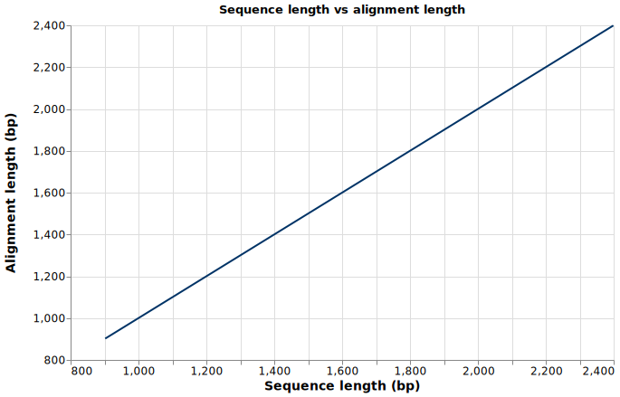
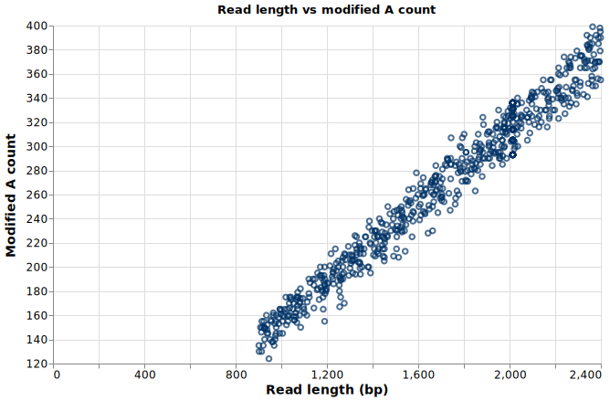

# plot_series: line and scatter plots from the sandbox

*2026-03-15T16:36:42Z by Showboat 0.6.1*
<!-- showboat-id: 0446544f-eb53-45c1-b828-853692ea95f0 -->

## Line plot

Each point is a dict with `x` and `y` keys (both finite numbers). Here we fetch all reads with `read_info`, skip unmapped reads (which have no `alignment_length`), and keep only those whose read ID starts with `0.` or `1.` — the reads with length variation in this BAM. Plotting sequence length against alignment length produces a near-perfect straight line, confirming that the two values track each other closely.

```bash
cat > /tmp/line_plot.py << 'EOF'
# Skip unmapped reads (no alignment_length) and keep only 0. and 1. reads
rows = read_info('demo.bam')
points = []
for r in rows:
    rid = r['read_id']
    if r['alignment_type'] == 'unmapped':
        continue
    if rid[0] == '0' or rid[0] == '1':
        points.append({'x': r['sequence_length'], 'y': r['alignment_length']})

result = plot_series(
    points,
    kind='line',
    output_path='ai_chat_output/read-length-line.svg',
    xlabel='Sequence length (bp)',
    ylabel='Alignment length (bp)',
    title='Sequence length vs alignment length',
)
print('Written to: ' + result['path'])
print('Points plotted: ' + str(result['points_plotted']))
EOF
rm -f ./demo/ai_chat_output/read-length-line.svg && node ./dist/execute-cli.mjs --dir ./demo /tmp/line_plot.py
```

```output
Written to: ai_chat_output/read-length-line.svg
Points plotted: 527
```

```bash {image}

```



## Scatter plot

The same `points` list with `kind="scatter"` renders each point as an independent dot instead of a connected line. Here we use all mapped reads and plot read length against modified-A count — useful for spotting whether longer reads carry proportionally more modifications.

```bash
cat > /tmp/scatter_plot.py << 'EOF'
# Scatter plot: read length vs modified-A count across all reads
rows = read_info('demo.bam', limit=200000)
points = []
for r in rows:
    mod_str = r.get('mod_count', '')
    try:
        mod_count = int(mod_str.split(':')[1].split(';')[0])
    except (IndexError, ValueError):
        continue
    points.append({'x': r['sequence_length'], 'y': mod_count})

result = plot_series(
    points,
    kind='scatter',
    output_path='ai_chat_output/length-vs-mods.svg',
    xlabel='Read length (bp)',
    ylabel='Modified A count',
    title='Read length vs modified A count',
)
print('Written to: ' + result['path'])
print('Points plotted: ' + str(result['points_plotted']))
EOF
rm -f ./demo/ai_chat_output/length-vs-mods.svg && node ./dist/execute-cli.mjs --dir ./demo /tmp/scatter_plot.py
```

```output
Written to: ai_chat_output/length-vs-mods.svg
Points plotted: 900
```

```bash {image}

```



## Return value and the write-only contract

plot_series returns a dict with three keys:

| Key | Type | Value |
|-----|------|-------|
| `path` | str | Path to the written SVG, relative to `--dir` |
| `points_plotted` | int | Number of points rendered |
| `note` | str | Reminder that the SVG cannot be read back by the sandbox |

The SVG is intentionally blocked from `read_file()`. The sandbox cannot interpret pixel data, so the contract is: write the path, report it to the user, let them open it externally.
